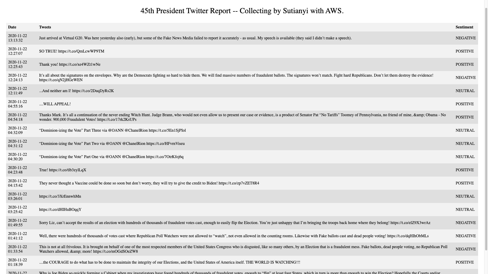
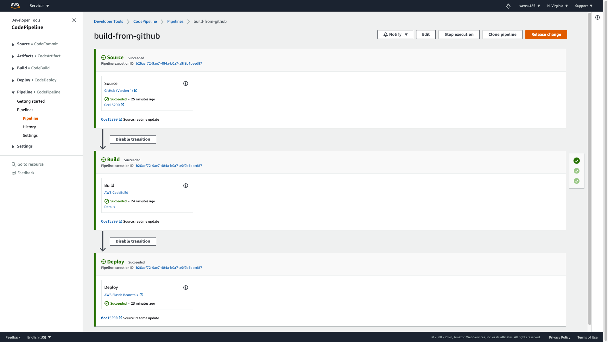
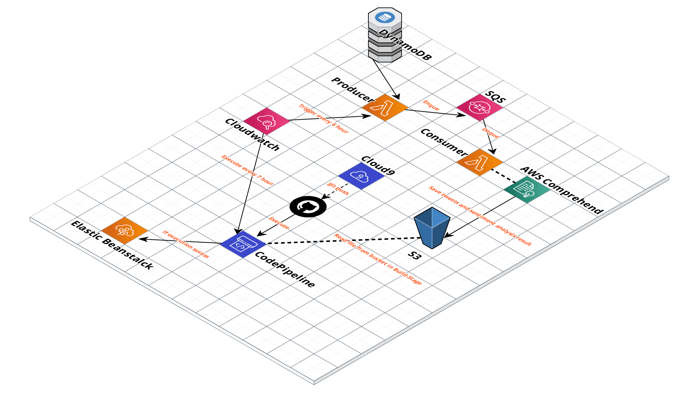

# The 45th President of United States Twitter Report

This is my Flask web application hosted on AWS Elastic Beanstalk: http://flask-web-evn.eba-2xusf33v.us-east-1.elasticbeanstalk.com/. I'm interested in how does President Trump feel after he lose the election so I built a website to update his top 20 most recent tweets and perform sentiment analysis on them every 7 hour. 

## Motivation

I'm trying to exercise good practive during development cycle and learn about cloud computing through the process. The project accomplishs CI/CD with AWS CodeBuild and CodePipeline and is deployed with AWS Elastic Beanstalck.

## Features

- 100% on Cloud
- Severless Web Application 
- Easy to customize and scale
- Continuous Integration + Continuous Deployment

## Yotube Demo
Design Diagram Walkthrough:

Continuous Delivery Demo:

## Screenshots

Website screenshot:

CodePipeline screenshot:

## Framework

Project Diagram: 

Top part of the diagram(anything above Cloudwatch service) is for my serverless-data-pipeline project: https://github.com/wensu425/aws-data-pipeline.git

